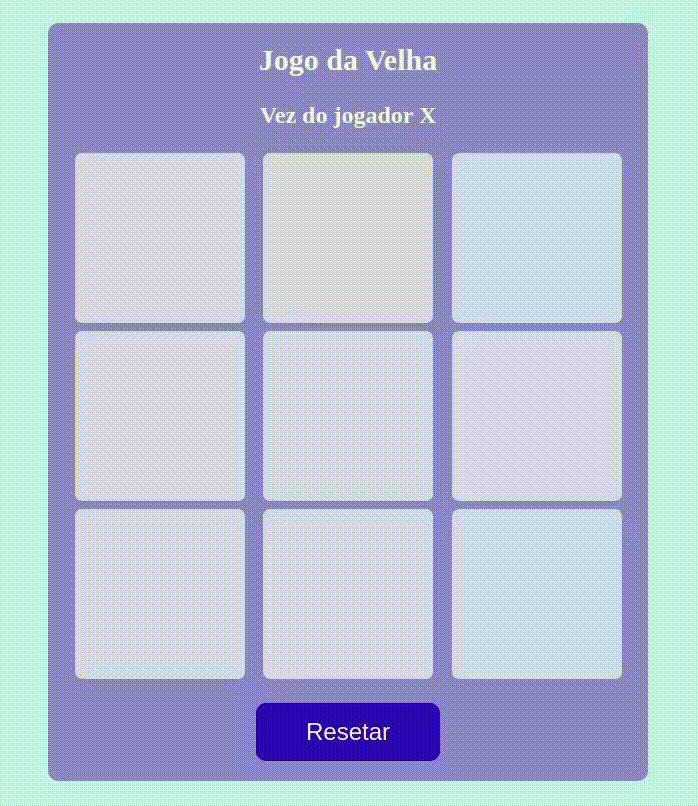

# JogoDaVelha
Boas-vindas ao repositório do Jogo da Velha, esse dojo foi desenvolvido com o intuito de estar ajudando a praticar o conteúdo visto nas aulas da Trybe. 
Nesse projeto foi utilizado: Logica de programação, laços de repetição, arrays, funções, dom e seletores, criar elementos de forma dinâmica, eventos.
Abaixo a demonstraçao:

